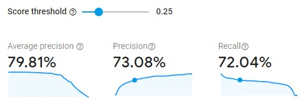
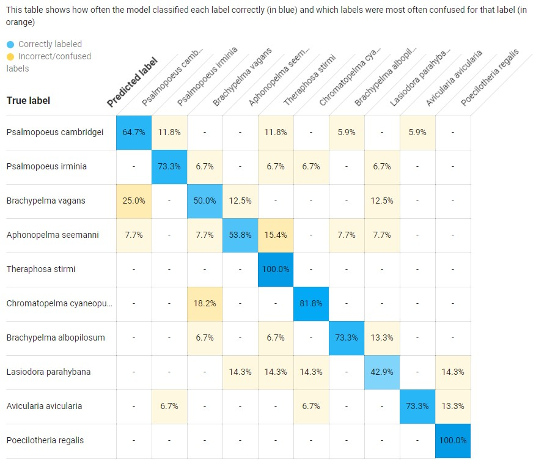
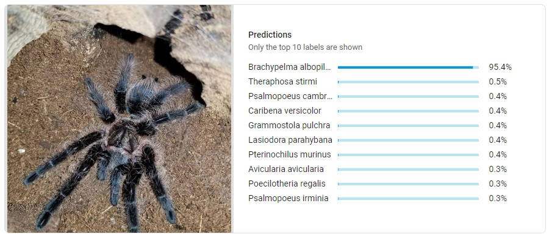

# Scraper for Tarantula Classifier App

TODO: Put link to Google Play Store App here once released.

This is an application to classify a tarantula's species.
It includes a scraper that gets and labels tarantula images by species, and a Flutter-based Android app. 
The labeled images are used to train a machine learning model, which is compressed and used by the app with Google Firebase's AutoML Vision Edge.

# Disclaimer

Not all tarantula species can be identified visually. 
I am not an entomologist, just a hobby tarantula keeper who happens to be a software developer working on a personal project. 
If a human cannot visually distinguish two species, then there's a good chance a machine learning model won't be able to either. 
All classification confidence values should be taken with a grain of salt. 

That being said...

# The Model

A model trained on 15 species with a minimum of 100 images each has the following performance:

However, once deployed to an Android app, the model becomes completely unusable. 
Using a test image of Majora, my Brachypelma albopilosum, that was classified with ~95% confidence online (see image above), the app's compressed model gives it less than 5% confidence, while completely different looking species get a confidence of up to 50% (results differ with each attempt). 
I am awaiting a response from Google Firebase Support about how to deal with this.

# The Scraping Algorithm

1) Get all currently accepted scientific names of tarantula species from the World Spider Catalog
2) Get all formerly accepted scientific synonyms, as well
3) Scrape Arachnoboards tags for images of each species + synonyms and label as the currently accepted scientific name
4) Exclude unsuitable images (i.e. molts, enclosures, ventral shots, ...)
5) Make separate directories that contain only those species with at least 10 and 100 images

# TODOs

* Is there a way to include gender?
* Scrape more sources
* Retrain model once there are more species with 100+ images
* Fix model performance on Android app and release to Google Play Store
